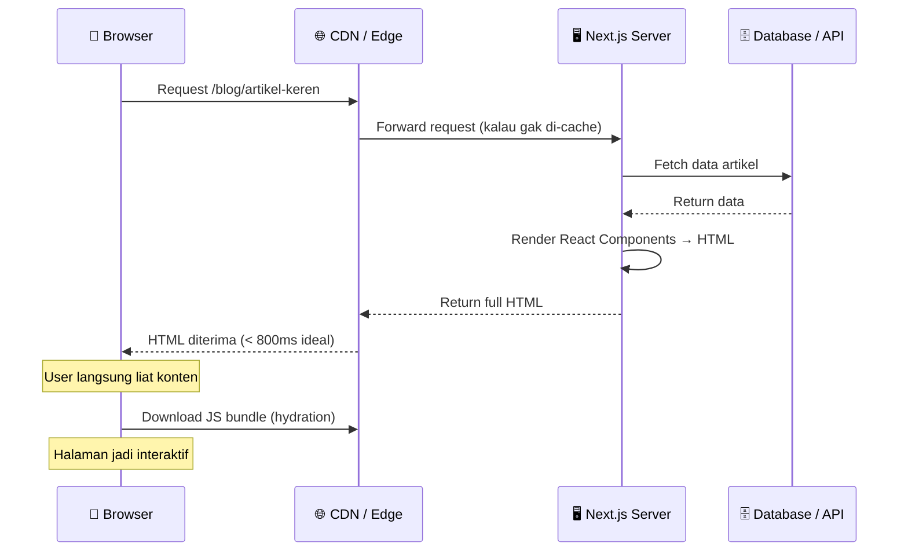
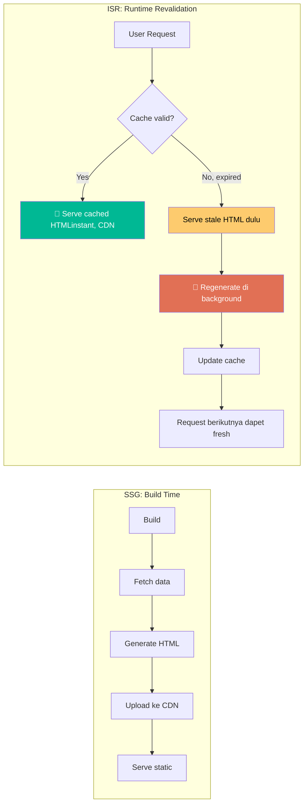
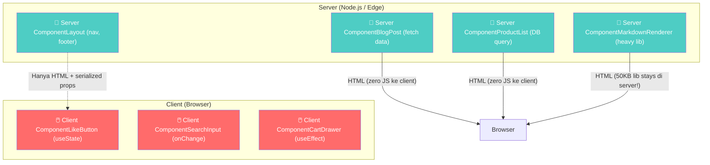
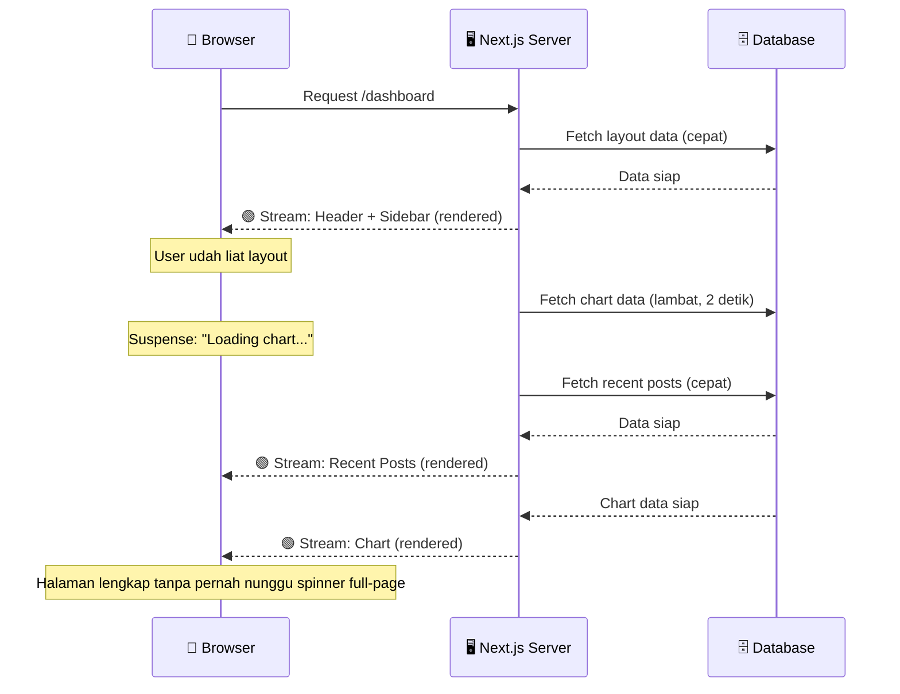
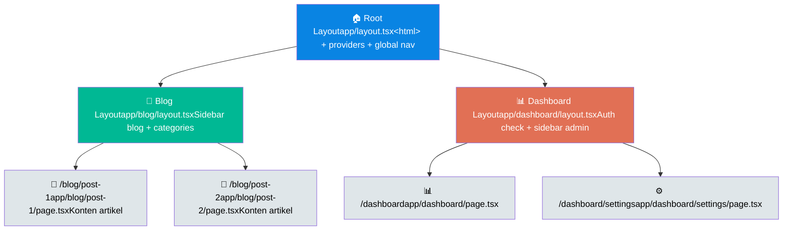
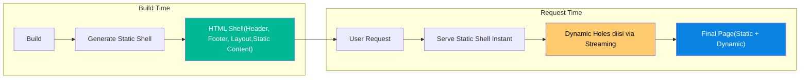
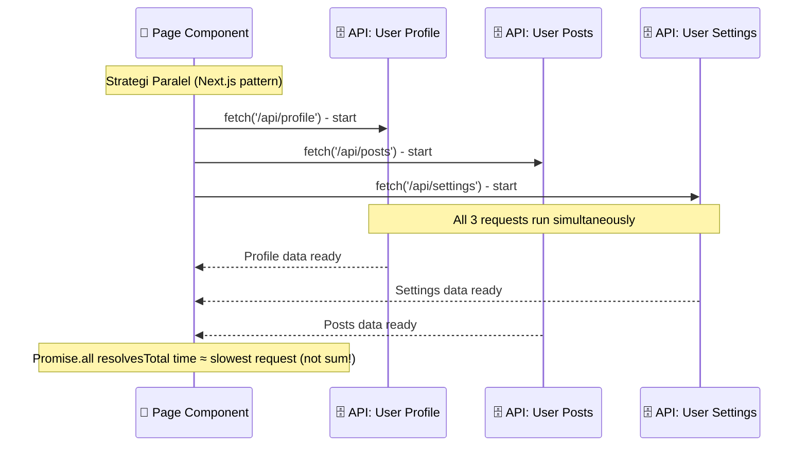
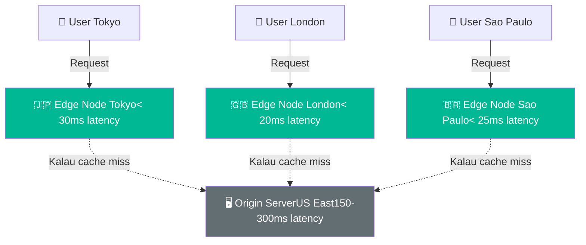

## 1. Pendahuluan: Kenapa Gw Peduli Sama Performance

Gw inget pertama kali deploy aplikasi React production. Waktu itu gw pake Create React App (CRA is a thing, ya dulu). Build-nya 400KB JS gzipped, Lighthouse score 42, dan SEO-nya nonexistent karena semuanya nunggu JavaScript render. 💀

Waktu itu gw mikir, "I have no idea... emang gitu kali aplikasi React."

**Spoiler: nope**.

Web performance bukan cuma soal ngejar skor hijau di Lighthouse biar keliatan keren di Tech Twitter. Amazon pernah ngehitung: **setiap 100ms latency tambahan bikin revenue mereka turun 1%.** Google juga nemuin kalau halaman yang loading-nya dari 1 detik ke 3 detik **nambahin bounce rate 32%.** Ini bukan masalah vanity metrics , ini masalah duit, user retention, dan apakah produk lo bakal dipake orang atau ditinggal. Performance is literally money.

Masalahnya, React sebagai *library* , nggak pernah dirancang untuk nge-handle semua ini sendirian. React itu brilliant untuk bikin UI component dan manage state. Tapi untuk hal-hal kayak routing, rendering strategy, data fetching, SEO, caching, dan performance optimization di level infrastruktur? React pun bilang "Nahh, itu bukan job desk gw."

Di sinilah Next.js masuk. *tuca doca JJK edit epic entrance music*

Next.js bukan cuma "React dengan beberapa fitur tambahan." Next.js adalah **operating system untuk aplikasi React di production.** Dia ngambil semua pelajaran pahit dari bertahun-tahun developer struggle dengan React di production, dan ngewrap semuanya dalam framework yang sangat opinionated tapi somehow tetep fleksibel.

Ini adalah glaze gw ke Next.js — tapi didukung data, diagram, dan argumen. Gw bakal breakdown kenapa gw believe Next.js 16 adalah framework React yang **paling teroptimasi yang pernah dibangun**, dari layer paling bawah (build toolchain) sampe paling atas (deployment infrastructure). Dan percaya deh, ini bukan glazing tanpa dasar.

Dan ya, gw juga bakal jujur soal sisi gelapnya. No framework is perfect, walau Next.js nyaris perfect.

---

## 2. React Itu Keren, Tapi...

Before gw glazing Next.js, gw perlu fair dulu ke React. React adalah salah satu inovasi paling penting dalam sejarah web development. Component model, declarative UI, virtual DOM , ini semua mengubah cara kita bikin aplikasi web.

Tapi React itu library UI. Bukan framework.

Dan sebagai library, React ninggalin banyak gap yang harus lo isi sendiri — emang by design, bukan karena React-nya kurang.

### Client-Side Rendering (CSR) by Default

Default React rendering itu CSR: browser download JS bundle (yang makin lama makin gede), parse JavaScript, render komponen, baru user bisa liat konten. Selama proses itu, user ngeliat blank screen. Ini bukan cuma UX yang buruk , ini juga masalah SEO karena crawler kayak Googlebot kadang gak sabaran nunggu JS render.


Bahkan setelah React 18 ngenalin `renderToPipeableStream` untuk SSR, tetep aja lo butuh server runtime untuk pake itu. React sendiri gak nyediain servernya.

### Hydration is Expensive

SSR tradisional (sebelum RSC) punya masalah fundamental: **hydration**. Server generate HTML, kirim ke browser. Browser render HTML-nya, keliatan cepat. Tapi setelah JS bundle download, React harus "hydrate" seluruh component tree , basically ngejalanin ulang semua komponen di client untuk nge-attach event listener.

Ini artinya: meskipun konten udah keliatan, user belum bisa interaksi. Dan semakin gede aplikasi lo, semakin lama hydration-nya.

### JavaScript Bundle yang Membengkak

Ini masalah klasik yang semua React developer pernah ngalamin. Lo mulai proyek kecil, install beberapa library, tambahin animasi, state management, form library... dan tiba-tiba first-load JS lo 500KB+.

Di dunia React tradisional, **semua kode yang lo tulis dikirim ke browser.** Internal logic, data fetching, database queries , semuanya. Kecuali lo manual bikin API route terpisah dan fetch dari client.

### SEO yang Bikin Pusing

Google bilang mereka bisa index JavaScript. Prakteknya? Gak selalu. Banyak banget horror stories tentang website React yang gagal di-index dengan benar, terutama untuk konten dinamis. Dan bahkan kalau Google bisa, social media crawlers (Twitter, Facebook, LinkedIn) seringkali gak jalanin JavaScript sama sekali. Link preview lo bakal kosong.

### Poor TTFB (Time to First Byte)

Di CSR murni, TTFB itu cepet karena server cuma ngirim HTML shell kosong. Tapi metrik yang beneran penting , FCP (First Contentful Paint) dan LCP (Largest Contentful Paint) , justru lambat banget karena harus nunggu JS download dulu.

Jadi you get "good" TTFB but terrible user experience. Metrik yang misleading.

---

## 3. Next.js: Bukan Sekadar Framework React

Next.js lahir di 2016, diciptain sama Guillermo Rauch dan tim Vercel (waktu itu masih Zeit). Di masa itu, ekosistem React masih chaotic. Banyak developer struggle dengan setup SSR, routing, code splitting, dan deployment. Webpack config aja udah bisa jadi proyek sendiri.

Next.js hadir dengan filosofi radikal: **"Convention over configuration."** Bikin file di folder `pages/` → otomatis jadi route. Configure router? Skip. Setup Webpack? (well, dulu Webpack, sekarang Turbopack). Pusing mikirin SSR vs CSR? Next.js handle.

### Apa Sebenarnya "Optimasi" Itu?

Sebelum gw lanjut, gw perlu clarify dulu: optimasi itu bukan cuma *satu hal*. Ini adalah rangkaian keputusan engineering yang terjadi di berbagai lapisan. Gw definisiin 5 metrik optimasi yang bakal gw pake sebagai framework evaluasi:

| Metrik | Artinya |
|--------|---------|
| **TTFB (Time to First Byte)** | Waktu dari user request sampe byte pertama HTML diterima. Ideal: &lt; 800ms |
| **FCP (First Contentful Paint)** | Kapan konten pertama muncul di layar. Ideal: &lt; 1.8s |
| **LCP (Largest Contentful Paint)** | Kapan konten paling gede (biasanya hero image) selesai render. Ideal: &lt; 2.5s |
| **INP (Interaction to Next Paint)** | Seberapa responsif halaman ke input user. Ideal: &lt; 200ms |
| **CLS (Cumulative Layout Shift)** | Seberapa banyak layout "loncat" saat loading. Ideal: &lt; 0.1 |
| **Developer Productivity** | Seberapa cepat developer bisa ship features. Gak bisa diukur pake milidetik, tapi dampaknya ke bisnis justru paling gede |

Next.js ngakalin semuanya , dari layer build time, server time, network time, browser time, sampe developer time.

### Evolution: Dari Pages Router ke App Router

Kalau lo udah lama di ekosistem Next.js, lo tau ada dua era: **Pages Router** dan **App Router.**

Pages Router (Next.js 1-12) itu sederhana dan powerful. Tapi arsitekturnya punya keterbatasan fundamental: satu layout per halaman, data fetching terbatas di `getServerSideProps`, dan gak ada support untuk React Server Components.

App Router (Next.js 13+) adalah rewrite arsitektur yang memanfaatkan React 18+ features: Server Components, Streaming, Suspense. Lo bisa bilang ini incremental upgrade — tapi realitanya ini adalah paradigm shift total tentang gimana kita mikirin aplikasi React.

Dan di Next.js 16, App Router udah sepenuhnya matang. Turbopack default di dev DAN build. React Compiler stable. Cache Components menggantikan eksperimen-eksperimen sebelumnya. Middleware berubah jadi Proxy. Ini adalah **era baru Next.js** , dan gw bakal jelasin kenapa ini penting banget.

---

## 4. Multi-Layer Optimization: Strategi Vercel yang Gila

Yang bikin Next.js beda dari framework lain adalah pendekatan mereka: optimize di **lima layer sekaligus.** Dan ini bukan hyperbole — emang literally arsitektur design mereka.

```mermaid
graph TD
    A[Build Time] --> B[Server Time]
    B --> C[Network Time]
    C --> D[Browser Time]
    D --> E[Developer Time]

    A1["&#9679; Turbopack (Rust-based)&#9679; Static Generation&#9679; Tree Shaking&#9679; Code Splitting"] -.-> A
    B1["&#9679; SSR + Streaming&#9679; RSC Execution&#9679; Edge Runtime&#9679; Cache Components"] -.-> B
    C1["&#9679; CDN Edge Caching&#9679; Compressed Assets&#9679; Incremental Prefetching&#9679; Optimized Images"] -.-> C
    D1["&#9679; Automatic Code Split&#9679; Lazy Loading&#9679; React Compiler (auto-memo)&#9679; Font Self-Hosting"] -.-> D
    E1["&#9679; Convention over Config&#9679; File-based Routing&#9679; Fast Refresh&#9679; TypeScript First-Class"] -.-> E

    style A fill:#ff6b6b,color:#fff
    style B fill:#4ecdc4,color:#fff
    style C fill:#45b7d1,color:#fff
    style D fill:#96ceb4,color:#fff
    style E fill:#ffeaa7,color:#000
```



**Build Time:** Sebelum aplikasi lo nyentuh server sekalipun, Next.js udah ngerjain banyak hal di belakang layar. Turbopack (Rust-based bundler) ngebuild aplikasi lo berkali-kali lipat lebih cepat dari Webpack. Static pages di-pre-render jadi HTML. Kode di-split otomatis berdasarkan route. Tree shaking ngebuang kode yang gak kepake.

**Server Time:** Ini jantungnya Next.js modern. Dengan React Server Components, sebagian besar rendering terjadi di server , bukan di browser user. Server yang powerful, deket ke database, bisa ngerender komponen secepat mungkin lalu kirim hasilnya sebagai HTML stream.

**Network Time:** File yang lo kirim ke browser lebih kecil dan lebih sedikit. Image di-resize otomatis sesuai viewport. Font di-self-host (no external requests). Kode cuma dikirim untuk halaman yang dibuka. Dan dengan CDN Vercel, assets lo tersebar di edge network global.

**Browser Time:** Di sisi client, Next.js pake strategi agresif untuk ngurangin kerjaan browser. Code splitting per-route artinya browser cuma download kode yang diperlukan untuk halaman itu, bukan seluruh aplikasi. Lazy loading images. Prefetching halaman berikutnya saat user hover link. React Compiler auto-memoization.

**Developer Time:** Dan yang sering dilupain: developer experience. Shipping features lebih cepat = lebih banyak iterasi = produk lebih baik. Convention over configuration, TypeScript first-class, Fast Refresh, dan CLI tools yang mature.

Coba deh lo setup SSR sendiri pake Express + React. Lo gak akan dapet integrasi sedalem ini. Synergy antar layer-nya yang bikin Next.js beda level.

---

## 5. SSR: Senjata Pertama yang Bikin Next.js Beda

Server-Side Rendering adalah fitur yang pertama kali bikin Next.js naik daun. Di era React awal, SSR adalah mimpi buruk untuk di-setup. But here's the thing: Next.js bikin SSR jadi *default behavior*, bukan afterthought.

### Gimana SSR Bekerja di Next.js



Prosesnya simpel tapi powerful:

1. User request halaman `/blog/artikel-keren`
2. Next.js server fetch data dari database atau API
3. Server render React components menjadi HTML string
4. HTML dikirim ke browser , **user langsung bisa baca konten**
5. Di background, JavaScript bundle didownload
6. React hydrate komponen, dan halaman jadi sepenuhnya interaktif

Perbedaan dengan CSR itu dramatis. Di CSR, user harus nunggu **semua** JavaScript download dulu sebelum liat konten apa pun. Di SSR, konten langsung muncul, dan JavaScript nyusul.

### Bukan Cuma SEO

Banyak yang mikir SSR cuma penting buat SEO. Itu mindset yang outdated. SSR juga krusial untuk:

- **Performance di device lemah:** User dengan HP murah atau koneksi lambat dapet konten lebih cepat karena server yang ngerjain rendering, bukan device mereka
- **Social sharing:** Twitter, Facebook, LinkedIn crawler bisa baca meta tags lo dari HTML yang udah dirender , tanpa eksekusi JavaScript
- **First impression:** User lebih mungkin stay di halaman yang keliatan kontennya dalam &lt; 2 detik

Dan Next.js bikin SSR jadi effortless. Bikin Server Component, fetch data pake async/await — Next.js otomatis render di server. Gak ada `getServerSideProps`. Gak ada config khusus. Gak ada setup bundler manual.

```tsx
// app/blog/[slug]/page.tsx
// Ini Server Component - render di server, bukan di browser
import { db } from '@/lib/db'

export default async function BlogPost({
  params,
}: {
  params: Promise<{ slug: string }>
}) {
  const { slug } = await params
  const post = await db.post.findUnique({ where: { slug } })

  return (
    <article>
      <h1>{post.title}</h1>
      <div dangerouslySetInnerHTML={{ __html: post.content }} />
      Dibaca {post.views} kali
    </article>
  )
}
```


---

## 6. SSG + ISR: Kombinasi Mematikan Static + Dynamic

Kalau SSR adalah "render setiap request," Static Site Generation (SSG) adalah "render sekali, serve selamanya dari CDN." Dan Next.js punya keduanya , plus model hybrid yang disebut Incremental Static Regeneration (ISR).



### Static Site Generation (SSG)

Ini konsep sederhana dengan dampak gede: di build time, Next.js nge-fetch semua data yang diperlukan, ngerender jadi HTML, dan nyimpen hasilnya. Di production, halaman-halaman ini di-serve dari CDN , **zero server compute, latency sub-50ms secara global.**

Cocok buat:
- Blog posts
- Landing pages
- Dokumentasi
- Product listing yang jarang berubah

### Incremental Static Regeneration (ISR)

Masalahnya: gimana kalau data berubah? Di SSG murni, lo harus rebuild seluruh aplikasi. Untuk blog kecil, fine. Untuk e-commerce dengan 10,000 produk? Gila. 💀 that's infinite build time.

ISR adalah jawabannya. Dengan ISR, lo bisa tentuin interval revalidate:

```tsx
// app/products/[id]/page.tsx
export const revalidate = 3600 // Revalidate setiap 1 jam

export default async function ProductPage({
  params,
}: {
  params: Promise<{ id: string }>
}) {
  const { id } = await params
  const product = await fetch(`https://api.toko.com/products/${id}`, {
    next: { tags: ['products'] },
  }).then(res => res.json())

  return <ProductDetail product={product} />
}
```

Apa yang terjadi:
1. Request pertama: halaman di-generate dan di-cache
2. Request berikutnya dalam 1 jam: langsung serve cache (instant)
3. Request setelah 1 jam: serve cache lama dulu, **sambil regenerate di background**
4. Request berikutnya setelah regenerate: dapet versi baru

User gak pernah nunggu. Dan dengan `revalidateTag()` (sekarang wajib pake cacheLife profile di v16), lo bisa invalidasi cache on-demand , misalnya pas CMS update konten. Itu keputusan arsitektur yang cerdas banget.

```tsx
// app/actions.ts
'use server'
import { revalidateTag } from 'next/cache'

export async function updateProduct(productId: string) {
  await db.product.update(productId, data)
  revalidateTag('products', 'max') // v16: wajib parameter kedua
}
```

HashiCorp , perusahaan enterprise infrastructure besar , secara spesifik nyebutin ISR sebagai game-changer buat workflow mereka. Di [Vercel blog](https://vercel.com/blog/how-hashicorp-developers-iterate-faster-with-isr), mereka ngejelasin gimana developer mereka bisa iterasi jauh lebih cepat karena gak perlu nunggu full rebuild setiap ada update konten.

Ini adalah pola yang impossible di React murni. Lo harus bikin sendiri caching layer, CDN integration, revalidation logic. Di Next.js? Beberapa baris config.

---

## 7. React Server Components: Game Changer yang Bikin Gw Melongo

Oke, ini section favorit gw. React Server Components (RSC) adalah perubahan paling fundamental dalam model pemrograman React sejak hooks. Dan gw gak exaggerating.

### Masalah yang Dipecahkan RSC

Di React tradisional, **semua komponen adalah client components.** Mereka dirender di browser, mereka punya state, mereka bisa pake hooks. Tapi ini artinya semua kode , termasuk logic data fetching dan dependencies berat , harus dikirim ke browser user.

Contoh klasik: lo punya komponen yang nge-render markdown pake library 50KB. Di React tradisional, user harus download 50KB itu, meskipun render markdown bisa aja dilakukan di server. Make it make sense??

RSC memisahkan dunia jadi dua: **Server Components** dan **Client Components.**



### Aturan Emas RSC

Di Next.js App Router, **semua komponen adalah Server Components by default.** Lo cuma perlu nambahin `'use client'` directive di atas file kalau komponen lo butuh interaktivitas browser:

```tsx
// Ini Server Component - render di server, zero JS ke browser
// Bisa async/await langsung, akses DB langsung
import { db } from '@/lib/db'

export default async function BlogList() {
  const posts = await db.post.findMany({ orderBy: { createdAt: 'desc' } })
  return (
    <ul>
      {posts.map(post => (
        <li key={post.id}>
          <h2>{post.title}</h2>
          {post.excerpt}
          {/* Client component di dalam Server Component - bisa! */}
          <LikeButton postId={post.id} initialLikes={post.likes} />
        </li>
      ))}
    </ul>
  )
}
```

```tsx
// Ini Client Component - ditandai 'use client'
// Cuma ini yang dikirim ke browser
'use client'
import { useState } from 'react'

export function LikeButton({ postId, initialLikes }: {
  postId: string
  initialLikes: number
}) {
  const [likes, setLikes] = useState(initialLikes)
  return (
    <button onClick={() => setLikes(l => l + 1)}>
      ❤️ {likes}
    </button>
  )
}
```

### Dampaknya Gila

Dengan RSC:
- Library berat kayak syntax highlighter, markdown parser, PDF generator **tetap di server.** Gak pernah dikirim ke browser.
- Database queries langsung dari komponen — skip API route terpisah buat data fetching sederhana
- Zero-cost abstraction: import library, pake, tanpa perlu mikirin bundle size impact
- Component tree yang lebih natural: lo bisa compose Server + Client Components dengan bebas

Lydia Hallie, salah satu educator React terkemuka, di [blog-nya tentang RSC](https://www.lydiahallie.com/) ngejelasin gimana RSC fundamentally mengubah cara developer mikirin component boundaries. Dia analogiin: "Kayak kita punya dua kanvas , satu di server yang bisa ngakses semua resources, dan satu di client yang spesifik untuk interaktivitas."

Dan Next.js adalah framework pertama (dan arguably masih yang terbaik) yang production-ready untuk RSC. React team sendiri nge-develop RSC dengan Next.js sebagai reference implementation.

---

## 8. Streaming UI + Suspense: Loading Bar is So 2015

Pernah nunggu halaman loading dengan spinner gede di tengah layar? That's so 2015. Angkat topi buat React team yang akhirnya ngasih kita solusi. Next.js dengan React Streaming dan Suspense ngenalin model rendering yang lebih manusiawi: **tampilin yang udah siap dulu, sisanya nyusul.** Basically kayak restoran fine dining , appetizer dulu, main course nyusul, lo gak kelaparan nunggu.



### Gimana Ini Bekerja

React 18 ngenalin `renderToPipeableStream` , API yang memungkinkan server nge-stream HTML ke browser sedikit demi sedikit. Dikombinasiin sama `&lt;Suspense&gt;`, lo bisa nentuin bagian mana yang bisa loading async:

```tsx
// app/dashboard/page.tsx
import { Suspense } from 'react'
import { Header, Sidebar } from '@/app/ui/layout'
import { RecentPosts } from '@/app/ui/posts'
import { RevenueChart, ChartSkeleton } from '@/app/ui/charts'

export default function DashboardPage() {
  return (
    <div className="dashboard-layout">
      {/* Ini dirender langsung - user liat layout instant */}
      <Header />
      <Sidebar />

      {/* Ini juga dirender langsung */}
      <Suspense fallback={<div>Loading posts...</div>}>
        <RecentPosts />
      </Suspense>

      {/* Ini streaming: munculin skeleton dulu, chart nyusul */}
      <Suspense fallback={<ChartSkeleton />}>
        <RevenueChart />
      </Suspense>
    </div>
  )
}
```

Yang terjadi:
1. Browser terima HTML untuk Header + Sidebar + skeleton chart
2. User langsung liat layout , gak ada blank screen
3. RecentPosts fetch selesai → HTML-nya di-stream dan gantiin "Loading posts..."
4. RevenueChart fetch selesai (mungkin lambat karena query analytics) → HTML chart gantiin skeleton
5. Semua ini terjadi dalam **satu HTTP response** , bukan multiple requests

### Kenapa Ini Revolusioner

Streaming UI fundamentally mengubah user experience web. Daripada "nothing → spinner → everything" (model lama), user dapet "something → more → complete." Ini adalah **progressive disclosure** yang terasa natural.

Dan Next.js bikin ini jadi effortless. Bikin komponen async, wrap dengan Suspense — streaming jalan otomatis. Tanpa setup pipeline, tanpa WebSocket, tanpa manual chunking.

Di Next.js 16, dengan `cacheComponents: true`, bahkan static shell dari halaman bisa dipre-render di build time, dengan dynamic hole yang diisi via streaming. Tapi soal itu, gw bahas di section Partial Prerendering nanti.

---

## 9. App Router: Arsitektur yang Bikin Pages Router Kayak Jadul

Pages Router itu keren untuk zamannya. Tapi App Router adalah lompatan arsitektur yang selevel bedanya dari PHP ke React.

### Nested Layouts: The Killer Feature

Di Pages Router, lo punya satu layout per halaman (biasanya pake `_app.tsx`). Di App Router, lo bisa bikin layout yang nested secara alami:



Yang gila: saat user navigasi dari `/blog/post-1` ke `/blog/post-2`, **layout Blog gak di-re-render.** Hanya konten halaman yang berubah. Layout tetap di tempatnya, state-nya persisten. Selain UX yang lebih smooth, ini juga performance win karena lebih sedikit komponen yang perlu di-render ulang.

### Route Groups, Parallel Routes, Intercepting Routes

App Router punya fitur routing yang sangat canggih:

```tsx
// app/(marketing)/layout.tsx  ← Route Group: marketing (gak ngaruh ke URL)
// app/(marketing)/page.tsx     → /
// app/(marketing)/about/page.tsx → /about

// app/(dashboard)/layout.tsx  ← Route Group: dashboard
// app/(dashboard)/page.tsx    → / (tapi layout beda!)

// app/@modal/default.tsx      ← Parallel Route: slot modal
// app/@modal/login/page.tsx   → /login (muncul sebagai modal overlay)

// app/feed/(..)photos/[id]/page.tsx  ← Intercepting Route
// Navigate dari /feed ke /photos/1 → muncul sebagai modal
// Direct access ke /photos/1 → full page
```

Ini adalah fitur yang impossible atau extremely complex di framework manapun. Next.js bikin jadi deklaratif dan file-system-based.

### Automatic Code Splitting by Route

Di balik layar, App Router auto-splits setiap route. Saat user buka `/blog/post-1`, mereka cuma download JavaScript untuk halaman itu , bukan untuk halaman `/dashboard/settings`. Ini dramatically reduces first-load bundle size tanpa developer harus mikirin `React.lazy()` atau dynamic imports secara manual.

---

## 10. Partial Prerendering: The Best of Both Worlds

Di Next.js 16, Partial Prerendering (PPR) udah stabilize , dengan nama konfigurasi baru: `cacheComponents`.

### Konsepnya Simple Tapi Radikal

PPR menggabungkan static rendering (cepat, CDN-cached) dengan dynamic rendering (data real-time) dalam **satu halaman yang sama.** Bayangin halaman produk e-commerce: header, footer, dan product title itu static (gak berubah antar user). Tapi harga dan stok itu dynamic (real-time, per-user mungkin beda).

Di dunia tradisional, lo harus milih: render statis semua (cepat tapi stale) atau render dinamis semua (fresh tapi lambat). PPR bilang, "Why not both?"



### Implementasi di Next.js 16

Di Next.js 16, enable PPR cukup dengan satu flag:

```ts
// next.config.ts
import type { NextConfig } from 'next'

const nextConfig: NextConfig = {
  cacheComponents: true, // 👈 Unifies PPR + useCache + dynamicIO
}

export default nextConfig
```

Di komponen-nya, tentuin mana yang static dan mana yang dynamic:

```tsx
// app/product/[id]/page.tsx
import { Suspense } from 'react'

export default async function ProductPage({
  params,
}: {
  params: Promise<{ id: string }>
}) {
  const { id } = await params
  const product = await fetchProduct(id)

  return (
    <div>
      {/* Static shell: dirender di build time */}
      <Header />
      <h1>{product.name}</h1>
      <ProductImages images={product.images} />

      {/* Dynamic hole: di-render per-request, di-stream */}
      <Suspense fallback={<PriceSkeleton />}>
        <LivePrice productId={product.id} />
      </Suspense>

      <Suspense fallback={<StockSkeleton />}>
        <LiveStock productId={product.id} />
      </Suspense>

      <Footer />
    </div>
  )
}
```

Yang terjadi:
1. Build time: Next.js render **static shell** (Header, product name, images, Footer). Ini di-cache di CDN.
2. Request time: Server serve static shell instant (&lt; 100ms dari CDN edge).
3. Sementara itu, server nge-fetch `LivePrice` dan `LiveStock`
4. Begitu data siap, HTML-nya di-stream ke browser
5. User gak pernah liat full-page spinner , halaman keliatan instant dan data nyusul

Ini adalah optimalisasi yang secara fundamental impossible di framework lain tanpa significant engineering effort. Dan di Next.js? Satu flag config.

---

## 11. Next.js Cache System: 4 Lapis Cache yang Bikin Pusing Tapi Worth It

Caching di Next.js itu sekaligus fitur paling powerful dan paling membingungkan. Gw akui: learning curve-nya steep. Kayak lo pertama kali liat `git rebase` , bikin pusing, tapi begitu paham, lo merasa kayak dewa. Tapi begitu lo paham, lo bisa bikin aplikasi yang performancenya absurd.


Next.js (terutama di v16) punya 4 layer caching:

```mermaid
graph TD
    Request["🌐 Incoming Request"]

    Request --> Layer1

    subgraph Layer1["Layer 1: Request Memoization"]
        RM["React `cache()`Deduplikasi fetch dalam 1 requestLifetime: per-render pass"]
    end

    Layer1 --> Layer2

    subgraph Layer2["Layer 2: Data Cache"]
        DC["`fetch()` cache / `unstable_cache`Cache hasil fetch/data queryLifetime: persistent (cross-request)"]
    end

    Layer2 --> Layer3

    subgraph Layer3["Layer 3: Full Route Cache"]
        RC["HTML + RSC Payload cacheCache seluruh output halamanLifetime: persistent (di server)"]
    end

    Layer3 --> Layer4

    subgraph Layer4["Layer 4: Router Cache"]
        RtC["Client-side in-memory cacheCache RSC payload di browserLifetime: session / staleTimes"]
    end

    Layer4 --> Browser

    style Layer1 fill:#ff6b6b,color:#fff
    style Layer2 fill:#feca57,color:#000
    style Layer3 fill:#48dbfb,color:#000
    style Layer4 fill:#ff9ff3,color:#fff
```

### Layer 1: Request Memoization

Ini level cache paling granular. React punya fungsi `cache()` yang memastikan fungsi yang sama cuma dipanggil sekali dalam satu render pass:

```tsx
import { cache } from 'react'

export const getPost = cache(async (slug: string) => {
  const post = await db.post.findUnique({ where: { slug } })
  return post
})

// Di komponen:
// getPost('hello-world') dipanggil 3x di tree yang sama
// Tapi database query cuma jalan SEKALI
```

### Layer 2: Data Cache

Ini cache persisten untuk hasil fetch. Di Next.js, `fetch()` request di-cache otomatis (kecuali di Dynamic Routes atau pake `cache: 'no-store'`):

```tsx
// Ini akan di-cache secara persisten
const data = await fetch('https://api.example.com/data', {
  next: { tags: ['data'], revalidate: 3600 },
})
```

Untuk non-fetch operations (database queries, ORM), pake `unstable_cache` atau , di Next.js 16 , `'use cache'` directive:

```tsx
async function getAnalytics() {
  'use cache'
  cacheLife('hours')
  cacheTag('analytics')

  return await db.query('SELECT * FROM analytics_daily')
}
```

`cacheLife` dan `cacheTag` udah stabil di v16 (no more `unstable_` prefix). `cacheLife` nentuin durasi dan stale-while-revalidate behavior, `cacheTag` bikin lo bisa invalidasi spesifik:

```tsx
// Revalidate specific tagged data
import { revalidateTag, updateTag } from 'next/cache'

// revalidateTag: expire cache, serve stale, regenerate bg (v16: wajib cacheLife profile)
revalidateTag('posts', 'max')

// updateTag: expire + refresh immediately (read-your-writes!)
updateTag(`user-${userId}`)
```

### Layer 3: Full Route Cache

Next.js nge-cache seluruh HTML + RSC payload dari halaman yang di-render statis. Ini disimpan di server dan di-serve langsung tanpa re-render komponen. Untuk static pages, ini artinya response time &lt; 50ms.

### Layer 4: Router Cache

Ini client-side cache di browser. Saat user navigasi antar halaman, Next.js nyimpen RSC payload di memory. Navigasi balik ke halaman sebelumnya? Instant , dari memory, bukan dari network.

Di Next.js 16, behavior Router Cache bisa dikontrol via `staleTimes`:

```ts
// next.config.ts
const nextConfig: NextConfig = {
  experimental: {
    staleTimes: {
      dynamic: 30,  // Dynamic routes cached 30 detik
      static: 180,   // Static routes cached 3 menit
    },
  },
}
```

### Kenapa Ini Rumit Tapi Worth It

Gw gak bohong: memahami kapan dan di mana data di-cache di Next.js itu butuh waktu. Kayak belajar main chess , aturannya gampang, mastering-nya yang susah. Tapi coba lo bayangin setup caching se-level ini sendiri: lo harus implementasi in-memory cache (Redis?), CDN cache, client-side cache, deduplication logic... dan semuanya harus koheren satu sama lain. That's a whole engineering team worth of work.

Next.js ngasih lo semua ini built-in, dengan invalidasi yang granular, dan dengan konvensi yang (relatif) sederhana. It's a tradeoff: lo investasi waktu untuk belajar, dan return-nya adalah aplikasi yang performancenya absurd tanpa lo setup infrastruktur caching sendiri.

---

## 12. Turbopack: Goodbye Webpack, Hello Rust

Webpack adalah backbone JavaScript bundling selama hampir satu dekade. Tapi Webpack juga lambat. Sangat lambat. Di proyek besar, initial dev server startup bisa 30-60 detik, dan HMR (Hot Module Replacement) bisa beberapa detik per perubahan. 💀 itu waktu yang lo bisa pake buat scroll TikTok atau bikin kopi.

Next.js berani ngelakuin hal yang radikal: **nulis ulang bundler mereka dari nol dalam Rust.** "Fine, I'll do it myself" energy—and they actually delivered.

### Kenapa Rust?

JavaScript (dan Node.js) itu single-threaded dan relatif lambat untuk operasi I/O dan CPU-intensive. Bundling itu CPU-intensive , parsing ribuan file, resolving dependencies, building dependency graph.

Rust adalah bahasa compiled yang extremely fast, memory-safe, dan punya concurrency model yang superior. Rust go brrr. Turbopack memanfaatkan ini untuk melakukan **incremental compilation** , cuma ngebuild ulang bagian yang berubah, bukan seluruh aplikasi.

### Benchmarks yang Bikin Melongo

Vercel klaim Turbopack bisa 700x lebih cepat dari Webpack untuk large applications. Tapi yang lebih konkret, ini hasil nyata dari perusahaan yang migrasi:

- **Leonardo AI** (platform AI image generation dengan 4.5 juta gambar per hari): build time dari **10 menit ke 2 menit** , 80% lebih cepat. Peter Runham, CTO Leonardo AI, bilang: *"Switching to Vercel transformed our workflow, cutting build times from 10 minutes to just 2 minutes."*
- **Sonos**: **75% faster build times** setelah migrasi ke Next.js + Vercel. Jonathan Lemon, Engineering Manager Sonos: *"Our developers are happier, we get to market faster."*
- **MotorTrend**: Build time berkurang **hingga 7x** setelah adopsi Next.js di Vercel.

### Default di Next.js 16

Mulai Next.js 16, **Turbopack adalah default untuk `next dev` DAN `next build`.** Flag `--turbopack` udah gak diperlukan lagi.

```json
// package.json , Next.js 16
{
  "scripts": {
    "dev": "next dev",      // Turbopack by default
    "build": "next build",  // Turbopack by default
    "start": "next start"
  }
}
```

Kalau lo masih butuh Webpack (misalnya ada custom Webpack plugin yang belum kompatibel), lo bisa opt-out:

```json
{
  "scripts": {
    "dev": "next dev",
    "build": "next build --webpack"
  }
}
```

Tapi realitanya: sebagian besar aplikasi gak butuh custom Webpack config. Turbopack nge-handle TypeScript, CSS, CSS Modules, Sass, PostCSS, images, fonts , semuanya out of the box.

### Filesystem Caching (Beta)

Turbopack di Next.js 16 juga support filesystem caching untuk development:

```ts
const nextConfig: NextConfig = {
  experimental: {
    turbopackFileSystemCacheForDev: true,
  },
}
```

Ini artinya: restart dev server gak perlu compile ulang semuanya dari nol. Compiler artifacts di-cache di disk, jadi restart hampir instant. Untuk proyek besar, ini game-changer banget.

---

## 13. React Compiler: Auto-Memoization, No More `useMemo`/`useCallback` Hell

Siapa di sini yang pernah debat soal `useMemo` dan `useCallback`?

React Compiler adalah jawaban React team untuk salah satu footgun terbesar di React: manual memoization. Dan ini bukan sekadar "nice to have" , ini adalah akhir dari penderitaan kolektif React developer soal `useMemo` dan `useCallback`. Di Next.js 16, React Compiler udah stable dan bisa diaktifkan dengan satu config:

```ts
// next.config.ts
const nextConfig: NextConfig = {
  reactCompiler: true, // Stable di Next.js 16
}
```

### Apa yang Dilakukan React Compiler

React Compiler menganalisis komponen lo di compile time (sebelum build) dan secara otomatis nambahin memoization di tempat yang tepat. Lo gak perlu lagi:

```tsx
// Sebelum React Compiler: manual memoization hell
const ExpensiveList = React.memo(function ExpensiveList({ items }: Props) {
  const sortedItems = useMemo(() => items.sort(/* complex sort */), [items])
  const handleClick = useCallback((id: string) => {
    doSomething(id)
  }, [])

  return sortedItems.map(item => (
    <ExpensiveItem key={item.id} item={item} onClick={handleClick} />
  ))
})
```

Dengan React Compiler:

```tsx
// Dengan React Compiler: kode lo apa adanya
function ExpensiveList({ items }: Props) {
  const sortedItems = items.sort(/* complex sort */)
  const handleClick = (id: string) => doSomething(id)

  return sortedItems.map(item => (
    <ExpensiveItem key={item.id} item={item} onClick={handleClick} />
  ))
}
```

Lebih sedikit kode, lebih sedikit bugs, performa tetap optimal. React Compiler nge-handle memoization, dependency tracking, dan re-render optimization secara otomatis.

### Kenapa Ini Penting

Di aplikasi React besar, memoization yang salah adalah sumber utama performance issues. Terlalu banyak memoization → overhead memory. Terlalu sedikit → unnecessary re-renders. Dan debugging-nya susah karena lo harus manual trace dependency arrays.

React Compiler ngehapus seluruh kategori bugs ini. Dan di Next.js 16, ini fully supported dalam production. Ini belum default (Vercel masih gathering data performa build), tapi bisa lo aktifkan sekarang.

---

## 14. Automatic Image & Font Optimization: Detail Kecil, Impact Gede

Ini mungkin kedengeran sepele. Tapi image dan font adalah dua kontributor terbesar untuk page weight dan CLS (layout shift). Next.js punya solusi built-in yang gak cuma efektif, tapi juga effortless.

### `next/image`: Bukan Sekadar `` Biasa

Komponen `next/image` itu salah satu fitur Next.js yang paling underrated. Di balik API yang sederhana:

```tsx
import Image from 'next/image'

<Image
  src="/hero-banner.jpg"
  width={1200}
  height={630}
  alt="Hero banner"
  priority // Load immediately for LCP elements
/>
```

Ada optimization engine yang kompleks:

1. **Automatic resizing:** Image di-resize sesuai viewport. User mobile gak perlu download gambar 2000px lebar.
2. **Modern formats:** WebP dan AVIF otomatis dipake kalau browser support , file size bisa 30-50% lebih kecil dari JPEG/PNG
3. **Lazy loading by default:** Gambar di bawah fold gak diload sampe user scroll mendekatinya
4. **Blur-up placeholder:** Placeholder base64 super kecil yang langsung muncul, lalu fade ke gambar asli
5. **CDN optimization:** Di Vercel, image optimization pake edge caching global

Di Next.js 16, ada beberapa improvement ke `next/image`:
- `minimumCacheTTL` default sekarang **4 jam** (dari 60 detik sebelumnya) , lebih sedikit revalidation cost
- `qualities` default jadi `[75]` , lebih sedikit `srcset` variants, lebih kecil HTML size
- Image 16px dihapus dari default `imageSizes` , hampir gak ada yang pake

### `next/font`: Zero Layout Shift, Guaranteed

CLS (Cumulative Layout Shift) sering disebabkan oleh web fonts yang lambat loading. Font custom lambat download → browser render pake fallback font → font selesai load → layout bergeser. Annoying banget.

Next.js solve ini dengan **self-hosting font otomatis:**

```tsx
// app/layout.tsx
import { Inter } from 'next/font/google'

const inter = Inter({
  subsets: ['latin'],
  display: 'swap', // Fallback font dulu, swap ke custom font
})

export default function RootLayout({ children }: { children: React.ReactNode }) {
  return (
    <html lang="en" className={inter.className}>
      <body>{children}</body>
    </html>
  )
}
```

Yang terjadi di balik layar:
1. Next.js download font dari Google Fonts **di build time**
2. Font file di-self-host , gak ada external request ke Google server
3. CSS `font-display: swap` + font size metrics di-inline → browser tau persis ukuran font sebelum load, **layout gak geser**
4. Hanya subset karakter yang diperlukan yang di-load (e.g., latin aja, gak perlu Cyrillic)

Ini privacy win (gak ada request ke Google) DAN performance win (self-hosted = lebih cepat, no layout shift). Saking bagusnya fitur ini, gw heran kenapa gak semua framework ngelakuin hal yang sama.

---

## 15. Smart Data Fetching: No More Waterfall Nightmare

Salah satu anti-pattern paling umum di aplikasi React adalah **waterfall fetching.** Lo fetch data A, terus pake hasilnya untuk fetch data B, terus pake hasilnya buat fetch data C. Request jalan serial, dan latency menumpuk.

Next.js punya beberapa strategi untuk nge-handle ini:

### Parallel Fetching

Daripada nungguin satu-satu, lo bisa initiate semua request bersamaan:



```tsx
// ✅ Parallel fetching , requests jalan bersamaan
async function getUserData(username: string) {
  const profilePromise = fetch(`/api/users/${username}/profile`)
  const postsPromise = fetch(`/api/users/${username}/posts`)
  const settingsPromise = fetch(`/api/users/${username}/settings`)

  const [profile, posts, settings] = await Promise.all([
    profilePromise,
    postsPromise,
    settingsPromise,
  ])

  return { profile, posts, settings }
}
```

Tapi kadang, data B emang tergantung data A. It's unavoidable. Untuk kasus ini, Next.js punya:

### Streaming + Suspense Pattern

Lo bisa render bagian yang datanya udah siap, sementara bagian yang dependent disuspend:

```tsx
export default async function Page({
  params,
}: {
  params: Promise<{ username: string }>
}) {
  const { username } = await params

  return (
    <div>
      {/* Ini dirender langsung , harus nunggu user data dulu */}
      <ProfileHeader username={username} />

      {/* Ini juga langsung */}
      <Suspense fallback={<PostsSkeleton />}>
        <UserPosts username={username} />
      </Suspense>

      {/* Ini stream , gak ngeblok section lain */}
      <Suspense fallback={<FriendsSkeleton />}>
        <MutualFriends username={username} />
      </Suspense>
    </div>
  )
}
```

### Server Actions: Mutasi Tanpa API Route

Ini fitur yang gw suka banget. Di dunia tradisional, lo bikin API route → client fetch ke API route → API route handle mutation → return response. Boilerplate-nya banyak.

Dengan Server Actions, lo bisa langsung define server-side function yang dipanggil dari client:

```tsx
// app/actions.ts
'use server'
import { db } from '@/lib/db'
import { revalidateTag } from 'next/cache'

export async function createPost(formData: FormData) {
  const title = formData.get('title') as string
  const content = formData.get('content') as string

  await db.post.create({ data: { title, content } })
  revalidateTag('posts', 'max') // Invalidate cache
}
```

```tsx
// app/new-post/page.tsx
'use client'
import { createPost } from '@/app/actions'

export function NewPostForm() {
  return (
    <form action={createPost}>
      <input name="title" placeholder="Judul" required />
      <textarea name="content" placeholder="Konten" required />
      <button type="submit">Publish</button>
    </form>
  )
}
```

Progressive enhancement: form tetap jalan bahkan tanpa JavaScript (HTML form submission). Dengan JavaScript, Next.js handle submission via fetch + revalidate UI otomatis. Clean.

---

## 16. Edge Runtime + Proxy (dulu Middleware): Deket ke User = Cepat

Latency is the real enemy. Lo bisa punya server super kenceng di Virginia, tapi user lo di Jakarta bakal ngerasain 200ms+ latency purely dari jarak fisik. Physics is undefeated, bro.

### Edge Runtime

Next.js bisa ngejalanin kode lo di edge , server Vercel yang tersebar di ratusan lokasi global. Bedanya dengan server tradisional (Node.js di satu region): edge runtime jalan **fisik lebih dekat ke user.**



Yang bisa lo jalanin di edge:
- A/B testing
- Authentication checks (JWT verification)
- Geo-based routing / localization
- Rate limiting
- A/B testing
- Bot detection

### Proxy: Evolusi Middleware

Di Next.js 16, Middleware di-rename jadi **Proxy.** Ini perubahan yang bikin sense: middleware selama ini dipake untuk routing decisions di network boundary , lebih mirip reverse proxy daripada application middleware.

```ts
// proxy.ts (sebelumnya middleware.ts)
export function proxy(request: Request) {
  const { pathname } = request.nextUrl

  // Redirect based on geo
  const country = request.geo?.country
  if (country !== 'ID' && pathname === '/id') {
    return NextResponse.redirect(new URL('/en', request.url))
  }

  // Auth check di edge (cepet!)
  const token = request.cookies.get('session')?.value
  if (!token && pathname.startsWith('/dashboard')) {
    return NextResponse.redirect(new URL('/login', request.url))
  }

  return NextResponse.next()
}
```

Yang penting: Proxy jalan di edge, jadi latency-nya minimal. User di Jakarta gak perlu nunggu request ke server di US East untuk redirect atau auth check.

---

## 17. Vercel Infrastructure: Why Deployment Matters

Ada yang bilang: "Next.js bagus, tapi lo ke-lock-in ke Vercel." Ini partially true, tapi juga partially misunderstanding. Next.js bisa di-deploy di mana aja , Docker, Node.js server, AWS, Cloudflare. Tapi emang bener: sinergi Next.js + Vercel itu absurd.

### CI/CD Pipeline yang Gak Bikin Stres

Push ke GitHub → Vercel otomatis deploy. Preview deployment untuk setiap PR. Rollback instant. Custom domain + SSL otomatis. Ini bukan sekadar fitur "nice to have" — ini *competitive advantage* nyata:

- **Notion** , Sebelum pake Vercel, hotfix deployment bisa **1 jam.** Setelah migrasi ke Next.js + Vercel: **15 menit.** Rollback: **hitungan detik.** ([Vercel blog](https://vercel.com/blog/how-notion-powers-rapid-and-performant-experimentation))
- **Stripe** , Situs Black Friday mereka dibangun dalam **19 hari** dengan Next.js + Vercel. Hasil: **100% uptime,** memproses **17 juta+ edge requests** saat peluncuran. ([Vercel blog](https://vercel.com/blog/architecting-reliability-stripes-black-friday-site))

### Fluid Compute: Serverless, But Better

Vercel punya runtime "Fluid Compute" yang mengaburkan batas antara serverless dan traditional server. Lo gak perlu manage server, scaling otomatis, cold start minimal. Tapi lo tetap dapet Node.js full runtime (beda sama edge yang punya limitasi).

### Kenapa Ini Relevan untuk Optimasi

Optimalisasi framework gak ada artinya kalau deployment infrastructure-nya lambat. Next.js dirancang dari awal dengan asumsi deployment di Vercel: CDN integration, edge caching, image optimization, ISR revalidation , semuanya ngasumsikan infrastruktur yang support mereka.

Bisa lo deploy Next.js di AWS? Bisa. Tapi lo harus setup sendiri: CDN (CloudFront), image optimization service, ISR cache store, edge functions. It's doable, tapi lo bayar dengan developer time.

---

## 18. Real-World: Siapa Aja yang Pake Next.js dan Berhasil?

Ini bukan cherry-picked marketing slides. Ini perusahaan-perusahaan yang secara publik dan terukur dapet hasil signifikan setelah adopsi Next.js:


### Stripe , The Gold Standard

Stripe memproses transaksi ratusan miliar dolar. Situs Black Friday mereka dibangun dengan Next.js dalam 19 hari dan:

- **100% uptime** selama Black Friday (peak traffic tertinggi dalam setahun)
- **17 juta+ edge requests** di hari peluncuran
- Arsitektur yang reliable di bawah beban ekstrem

Stripe gak main-main soal reliability. Kalau situs mereka down, revenue hilang per detik. Fakta bahwa mereka milih Next.js untuk workload se-kritis ini , dan berhasil , itu endorsement yang sangat kuat.

### Notion , Velocity is Everything

Tim engineering Notion sebelumnya struggle dengan deployment pipeline yang lambat. Hotfix bisa makan waktu 1 jam dari code ke production. Setelah migrasi:

- **Hotfix: 1 jam → 15 menit** (75% lebih cepat)
- **Rollback: hitungan detik** (sebelumnya proses manual yang lama)
- Velocity engineering meningkat dramatis

Ini contoh klasik gimana "optimasi" bukan cuma soal milidetik di browser. Bisa deploy 4x lebih cepat = bisa iterasi 4x lebih banyak = produk lebih baik.

### Sonos , Enterprise-Grade Audio

Sonos, perusahaan speaker premium global, migrasi ke Next.js + Vercel dan dapet:

- **75% faster build times**
- **+10% performance scores** (Lighthouse / Core Web Vitals)
- Developer happiness meningkat signifikan

Jonanthan Lemon, Engineering Manager Sonos: *"Our developers are happier, we get to market faster. Vercel let us move with confidence."*

### Leonardo AI , Scale yang Gila

Leonardo AI adalah platform AI image generation yang memproses **4.5 juta gambar per hari.** Setelah migrasi:

- Build time: **10 menit → 2 menit** (80% pengurangan)
- Mampu menangani traffic masif tanpa degradasi performa

### PAIGE , Revenue Impact Langsung

PAIGE, brand fashion premium, membangun storefront dengan Next.js + Shopify + Vercel:

- **+22% revenue** saat Black Friday
- **+76% conversion rate**
- Build time dan iterasi jauh lebih cepat

### Yang Juga Pake Next.js

Bukan cuma case study di atas. Coba liat [Next.js Showcase](https://nextjs.org/showcase):
- **Nike** , Storefront global dengan SSR + ISR
- **OpenAI** , Website utama openai.com
- **Claude (Anthropic)** , claude.ai
- **Netflix** , Netflix Jobs platform
- **Spotify** , Berbagai microsite dan campaign
- **NerdWallet** , Platform financial advice
- **Twilio** , Dokumentasi dan website marketing
- **TikTok** , Berbagai web properties
- **Hulu** , Streaming platform web experience

130,000+ GitHub stars, framework React #1, proyek open-source terbesar ke-14 di GitHub. Numbers don't lie.

---

## 19. Benchmark: Numbers Don't Lie

Gw gak punya lab testing kayak web.dev. Tapi gw bisa bikin perbandingan konseptual berdasarkan apa yang kita tau tentang masing-masing pendekatan:

| Metrik | React SPA (CSR) | Next.js Pages Router (SSR) | Next.js App Router (RSC) | Next.js 16 (PPR + Edge) |
|--------|-----------------|---------------------------|--------------------------|--------------------------|
| **TTFB** | ⚡ Cepat (shell kosong) | 🟡 Medium (render server) | 🟡 Medium (render server) | 🟢 Cepat (static shell dari edge CDN) |
| **FCP** | 🔴 Lambat (nunggu JS) | 🟢 Cepat (HTML ready) | 🟢 Cepat (HTML + stream) | 🟢 Sangat cepat (static shell) |
| **LCP** | 🔴 Lambat (JS download + render) | 🟢 Cepat (HTML include image) | 🟢 Cepat (optimized image) | 🟢 Sangat cepat (CDN + optimized) |
| **JS Bundle** | 🔴 Sangat besar (seluruh app) | 🟡 Medium (hydration) | 🟢 Kecil (server components) | 🟢 Sangat kecil (RSC + PPR) |
| **SEO** | 🔴 Buruk (JS-dependent) | 🟢 Bagus (HTML server) | 🟢 Bagus (HTML server) | 🟢 Bagus |
| **INP** | 🟡 Bervariasi | 🟡 Hydration delay | 🟢 Lebih responsif | 🟢 Lebih responsif |
| **CLS** | 🔴 Sering masalah | 🟢 Baik (dengan next/image) | 🟢 Baik (font + image opt) | 🟢 Baik |
| **DX** | 🟡 Manual setup | 🟢 Konvensi jelas | 🟢 Sangat baik | 🟢 Sangat baik (Turbopack) |

&gt; **Catatan:** Ini simplified comparison. Hasil nyata tergantung implementasi spesifik, ukuran aplikasi, dan infrastruktur. Tapi arahnya jelas: Next.js (terutama App Router + PPR) secara konsisten outperform alternatif.

### Kenapa Gak Ada Angka Presisi?

Karena benchmark sintetis itu misleading. Aplikasi lo beda dari aplikasi gw. Yang lebih penting adalah **arsitektur fundamental** yang memungkinkan performa baik: server-first rendering, automatic code splitting, granular caching, edge deployment.

Next.js gak menang karena "lebih cepat 50ms dalam benchmark buatan." Next.js menang karena arsitekturnya dirancang untuk menjawab masalah fundamental web performance , bukan cuma nge-patch di atasnya.

---

## 20. When Next.js is NOT the Answer

Gw harus fair di sini. Next.js bukan silver bullet. Kadang lo butuh pisau, bukan chainsaw. Ada situasi di mana Next.js itu overkill atau bahkan counterproductive:

### Proyek Kecil / Static Situs Sederhana

Kalau lo cuma butuh landing page 3 halaman atau blog portfolio statis, Next.js mungkin terlalu berat. Alternatif:
- **Astro** , Dirancang khusus untuk content-focused sites. Zero JS by default, island architecture. Build output lebih kecil.
- **Hugo / 11ty** , This one actually the goat, Static site generators yang super cepat dan simpel
- **Plain HTML + Tailwind** , Kadang solusi paling simpel adalah yang terbaik

### Aplikasi yang Gak Butuh Server

Kalau lo bikin widget atau embeddable component yang purely client-side, React + Vite mungkin lebih cocok. Vite build-nya simpel, output-nya bersih, dan gak ada overhead framework.

### Aplikasi dengan Dynamic Rendering Berat

Ironisnya, kalau *seluruh* halaman lo dinamis (real-time data, WebSocket-driven), beberapa optimasi Next.js kayak SSG dan PPR jadi kurang relevan. Lo mungkin lebih cocok dengan:
- **Remix** , Lebih minimalis, lebih fokus ke web fundamentals
- **TanStack Start** , Full-stack React framework dengan pendekatan berbeda

### Tim yang Gak Mau Belajar Framework Opinionated

Next.js itu opinionated. Convention over configuration artinya lo harus ngikutin aturan main mereka. Kalau tim lo lebih suka kendali penuh atau udah punya setup kustom yang mature, migrasi ke Next.js mungkin lebih banyak friction daripada benefit.

---

## 21. The Hidden Costs

Optimasi Next.js gak gratis. Ada harga yang harus lo bayar:

### Learning Curve

Ini jujur: Next.js modern (App Router + RSC + Edge + Caching) itu kompleks. Lo harus paham:
- Server Components vs Client Components: kapan pake `'use client'`
- Caching behavior: kapan data di-cache, kapan gak, gimana cara invalidasi
- Rendering strategies: SSR, SSG, ISR, PPR, streaming , kapan pake yang mana
- Edge vs Node.js runtime: limitasi edge
- Build time vs runtime behavior

Untuk developer yang baru mulai React, ini overwhelming. Bahkan untuk developer React berpengalaman, transisi dari Pages Router ke App Router bisa bikin frustrasi.

### Caching Complexity

Caching di Next.js itu powerful tapi juga sumber bug yang susah didebug. "Data kok gak update?" atau "Kenapa halaman ini dirender ulang terus?" adalah pertanyaan yang umum.

Di Next.js 16, beberapa penyederhanaan dilakukan (`cacheComponents` sebagai unified flag, `updateTag` untuk read-your-writes). Tapi fundamental complexity-nya tetap ada.

### Debugging RSC

Server Components jalan di server. Error-nya muncul di server log, bukan di browser console. Tracing data flow antara server dan client butuh mental model yang berbeda. Tools debugging untuk RSC masih terus berkembang.

### Server Infrastructure

SSR, ISR, dan RSC butuh server yang running. Yes, lo bisa pake Vercel yang ngurusin semuanya. Tapi kalau lo self-host, lo harus manage server, scaling, CDN, dan cache invalidation sendiri. Ini bukan effort trivial.

### Bundle Size "Hidden"

Meskipun RSC dramatically ngecilin client-side JS, lo tetap punya framework overhead. Next.js client runtime, React runtime, dan hydration logic tetap perlu dikirim ke browser. Untuk halaman yang sangat sederhana, ini mungkin lebih gede dari yang lo butuhkan.

---

## 22. Masa Depan Next.js

Kalau lo liat trajectory Next.js dari 2016 sampe sekarang, polanya jelas: **server-first, progressively less client JavaScript, more intelligent defaults.**

### React Compiler Menjadi Default

React Compiler di Next.js 16 udah stable tapi belum default. Gw prediksi dalam beberapa rilis ke depan, auto-memoization akan jadi standard. Ini ngurangin cognitive load developer secara signifikan.

### Cache Components Maturation

`cacheComponents` dan `'use cache'` directive adalah fondasi untuk model pemrograman baru: komponen yang deklaratif nentuin caching behavior-nya sendiri. Bayangin masa depan di mana lo cukup nulis:

```tsx
async function ProductRecommendations({ productId }: { productId: string }) {
  'use cache'
  cacheLife('hours')
  cacheTag(`recommendations-${productId}`)

  const recommendations = await ai.recommend(productId)
  return <RecommendationGrid items={recommendations} />
}
```

Dan Next.js nge-handle semua: kapan revalidate, gimana serve stale data, kapan invalidate. No manual cache management.

### AI-Assisted Rendering

Dengan Vercel AI SDK yang makin mature, integrasi antara Next.js dan AI models makin seamless. Gw bisa liat masa depan di mana komponen Next.js bisa secara dinamis nge-render konten yang di-generate AI di server, dengan streaming dan caching yang optimal.

### Edge-Native Applications

Seiring edge runtime makin capable (support lebih banyak Node.js APIs), makin banyak aplikasi yang bisa jalan sepenuhnya di edge. Ini artinya latency global yang makin rendah.

### Build Adapters API

Fitur alpha di Next.js 16 ini memungkinkan platform deployment bikin custom adapters. Artinya: Next.js bakal makin portable ke berbagai hosting platform, bukan cuma Vercel. Ini bagus untuk ekosistem.

---

## 23. Final Verdict: Is It Really the Most Optimized React Framework?

Respect 🫡 udah sampe sini. Sekarang saatnya jawab pertanyaan judul.

### What "Most Optimized" Means

Kalau "paling teroptimasi" artinya "paling banyak fitur optimasi built-in," jawabannya **ya, tanpa keraguan.** Gak ada framework React lain yang ngasih lo SSR, SSG, ISR, Streaming, RSC, PPR, Edge Runtime, Image Optimization, Font Optimization, React Compiler, Turbopack, dan 4-layer caching , semuanya dalam satu framework dengan integrasi sedalam ini.

Kalau "paling teroptimasi" artinya "selalu menghasilkan aplikasi tercepat," jawabannya **tergantung.** Lo bisa bikin Next.js lambat (salah pake Client Components, gak optimize caching). Lo juga bisa bikin React SPA cepat (kalau aplikasinya kecil dan lo jago tuning). Next.js ngasih lo alat-alat terbaik, tapi lo tetap harus pake dengan benar. Skill issue tetep berlaku di sini. 🤷

### Verdict per Kategori

| Area | Verdict |
|------|---------|
| **SSR** | Excellent , Best-in-class, especially dengan streaming |
| **SSG** | Excellent , Output CDN-ready yang super cepat |
| **ISR** | Excellent , Hybrid model yang fleksibel dan scalable |
| **RSC** | Industry Leading , Next.js adalah reference implementation |
| **Streaming** | Excellent , Suspense integration yang seamless |
| **PPR** | Excellent , Unik, gak ada framework lain yang punya |
| **Caching** | Excellent , 4-layer caching dengan granular control, tapi kompleks |
| **DX** | Excellent , Convention over config, TurboPack, Fast Refresh |
| **Ecosystem** | Excellent , 130k+ GitHub stars, #1 React framework |
| **Learning Curve** | Moderate , Terjal untuk developer baru |
| **Complexity** | Moderate , Semakin banyak fitur, semakin banyak yang harus dipelajari |
| **Portability** | Good , Bisa deploy di mana aja, tapi optimal di Vercel |

### Kenapa Next.js Menjadi Dominan

Next.js gak dominan karena marketing Vercel (meskipun Vercel jago marketing). Next.js dominan karena dia memecahkan masalah nyata yang developer React rasain setiap hari:

1. "Aplikasi gw lambat di mobile"
2. "SEO gw jelek"
3. "Bundle size gw gede banget"
4. "Setup SSR ribet"
5. "Deployment pipeline gw bikin frustrasi"

Next.js gak cuma ngejawab pertanyaan-pertanyaan ini , Next.js bikin jawabannya jadi **default behavior.** Lo gak perlu mikirin "gimana cara setup SSR" karena itu udah built-in. Lo gak perlu konfigurasi code splitting karena itu otomatis. Lo gak perlu pilih antara statis dan dinamis karena PPR ngasih keduanya.

### Who Should Use It

- **Tim yang mau ship cepat:** Convention over config = lebih sedikit keputusan teknis yang harus dibuat
- **Aplikasi content-heavy:** Blog, e-commerce, documentation, marketing sites , SSG/ISR/PPR semuanya optimal di sini
- **Aplikasi yang butuh SEO:** Server-rendered HTML = search engines happy
- **Aplikasi skala besar:** Code splitting, caching, edge deployment = scalable by default
- **Developer yang pengen fokus ke produk, bukan infrastruktur:** Vercel nge-handle deployment, CDN, scaling

### Penutup

Di 2022, Gw bikin aplikasi React pertama gw. Setup SSR manual pake Express. Debug hydration mismatch sampe jam 2 pagi (not actually happen). Deploy ke VPS yang konfigurasinya bikin stress (additional contex: VPS gratis, memang agak shitty).

Di 2026, lo bisa:
- `npx create-next-app@latest`
- Nulis Server Component yang fetch data dari database
- Push ke GitHub
- Dapet aplikasi production dengan SSR, code splitting, image optimization, CDN global, preview deployments , **dalam hitungan menit.**

Apakah Next.js framework React paling teroptimasi yang pernah dibangun?

**Yes. And it's not even close 😛.**


---

*Referensi & Bacaan Lebih Lanjut:*

- [Next.js 16 Upgrade Guide](https://nextjs.org/docs/app/building-your-application/upgrading/version-16) , Dokumentasi resmi upgrade ke v16
- [Vercel Customers](https://vercel.com/customers) , Semua case study perusahaan yang gw sebut di atas
- [Next.js Showcase](https://nextjs.org/showcase) , Daftar website yang dibangun dengan Next.js
- [React 19.2 Blog](https://react.dev/blog/2025/10/01/react-19-2) , Fitur React terbaru yang didukung Next.js 16
- [How Notion Powers Rapid Experimentation](https://vercel.com/blog/how-notion-powers-rapid-and-performant-experimentation) , Notion case study
- [Architecting Reliability: Stripe's Black Friday](https://vercel.com/blog/architecting-reliability-stripes-black-friday-site) , Stripe case study
- [How Sonos Amplified Their DevEx](https://vercel.com/blog/how-sonos-amplified-their-devex) , Sonos case study
- [How HashiCorp Iterates Faster with ISR](https://vercel.com/blog/how-hashicorp-developers-iterate-faster-with-isr) , HashiCorp ISR deep dive
- [How PAIGE Grew Revenue by 22%](https://vercel.com/blog/how-paige-grew-revenue-by-22-with-shopify-next-js-and-vercel) , PAIGE e-commerce case study
- [Leonardo AI: 4.5M Images Daily with Next.js](https://vercel.com/customers/leonardo-ai-performantly-generates-4-5-million-images-daily-with-next-js-and-vercel) , Leonardo AI scale
- [How Fern Delivers 6M Monthly Views](https://vercel.com/blog/how-fern-delivers-6m-monthly-views-and-80-faster-docs-with-vercel) , Fern content platform
- [Web Vitals , web.dev](https://web.dev/vitals/) , Definisi dan threshold Core Web Vitals
